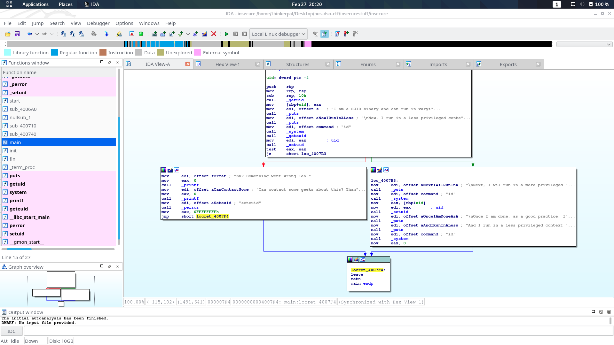
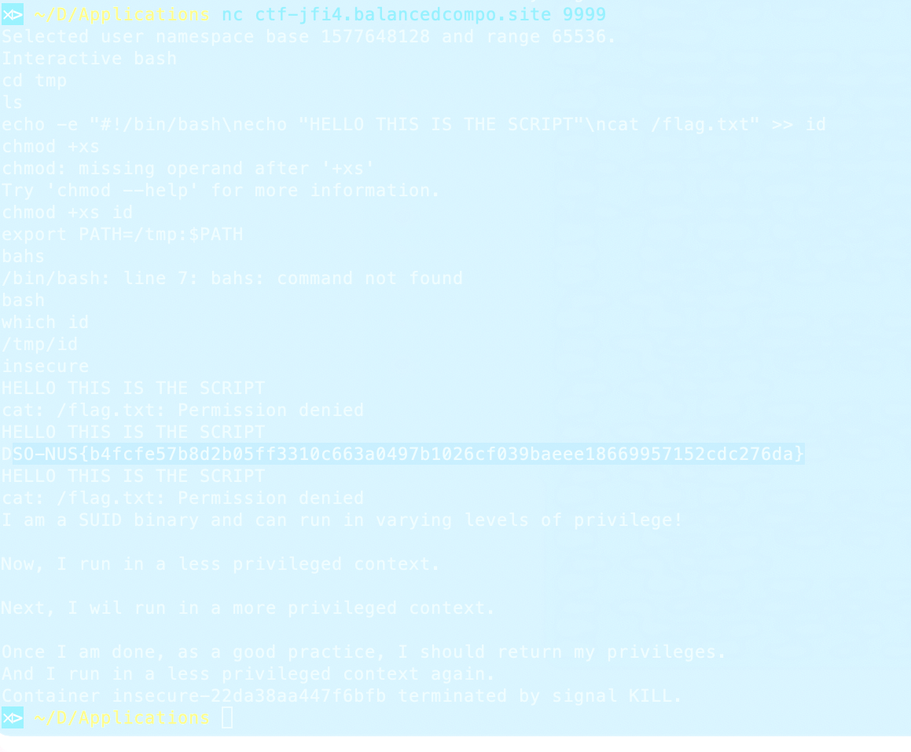

# Insecure
- Category: Pwn
- Points: 9x?/100
- Captures: No Idea
- Challenge Helpers: [Sean](https://github.com/serotonincrash)

## Challenge Description:
I don't remember the exact challenge description, but it had to do with how the executable had SUID bit set, which allowed you to run commands with the same permissions as the owner of the file. In our case, since the owner of the `insecure` file is `root` (UID 0), this meant that we could also read the `/flag.txt` file that was also owned by root (At least, I think it was root. I cannot remember).
## Files Attached:
- [insecure](insecure)

## Solution:
First, let's take a look at what setting the SUID bit on a file does:

With a typical file, it would probably have the following permissions:

`-rw-rw-r--` :
- The first `-` represents that this is a file (and not a directory, which will be represented by a `d`)
- The next 3 characters represent the permissions that the **owner** of the file has:
    - `r`: Able to Read
    - `w`: Able to Write
    - `-`: No other Permissions (usually populated by an `x` if the file is *executable*)
- The following 3 characters represent the premissions that the **group** of the file has:
    - `r`: Able to Read
    - `w`: Able to Write
    - `-`: No other Permissions (usually populated by an `x` if the file is *executable*)
The final 3 characters represent the permissions that **everyone else** has on the file:
    - `r`: Able to Read
    - `-`: Unable to Write
    - `-`: No other Permissions (usually populated by an `x` if the file is *executable*)

However, there are other special bits that can be set for that third bit of each set of permissions (User/Group/Others):
- `S`: `setuid/setgid` bit - people accessing the file has permissions that the owner/group of the file has
    - Applicable to Owner and Group Permissions for SUID and SGID respectively (Set User ID/Set Group ID)
- `s`: `setuid/setgid` bit with executable permissions - people accessing the file can also run the file with the permissions of the owner/group
    - Applicable to Owner and Group Permissions for SUID and SGID respectively (Set User ID/Set Group ID)
- `T`: Sticky bit - Allows only the owner of the files/directories within to create/edit files (usually used in `/tmp`)
    - Applicable to directories, shows up in "others" permission
- `t`: Sticky bit with executable permissions - Allows only the owner of the files/directories within to create/edit/execute files (usually used in `/tmp`)
    - Applicable to directories, shows up in "others" permission
    
The following image (and the linked article) gives a pretty good summary:
[](https://linuxhandbook.com/suid-sgid-sticky-bit/)
### Tools used:
- IDA64

Given the binary to download, we are able to use IDA64 to disassemble the `insecure` binary, as we can see below (Thanks to Sean for teaching me this - I had no idea how to start):



From the disassembly, we can see that the program calls the `id` command with a systemcall (which...you would also be able to see if I kept a screenshot of the original command output...oops!)

Once I spent 5 hours pulling my hair out and trying to understand what this program was trying to do and trying to understand what SUID was for, I finally realised that I could just...hijack the `id` application!

Going into `/tmp`, which is usually a directory that anyone could write files into, I decided that it was here that I will store my temporary application that could read the file at `/flag.txt` when `id` was called.

However, I realised that there were no text editors on the system...which made me rethink how I wanted to approach this challenge. Until I realised that I could simply `cat` the contents of my file into a file using stdout redirection and a version of `cat` that supports newlines (the shell was `bash`, after all)

The following shell program was written and used (formatted for better readablility):

```bash
#!/bin/bash
echo "HELLO THIS IS THE SCRIPT"
cat /flag.txt
```

The screaming was necessary. I assure you.



But we did find our flag!

## Flag:
```
DSO-NUS{b4fcfe57b8d2b05ff3310c663a0497b1026cf039baeee18669957152cdc276da}
```