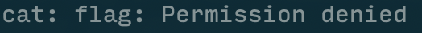
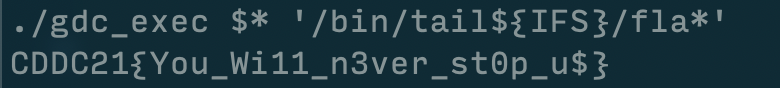

# Inject it Now!
- Category: Pwn
- Points: 200
- Captures: 23
## Challenge Description:
We managed to get access to one of the GDC servers. We believe it stores some interesting information. Help us retrieve it.

*(A netcat target was provided for us to access)*
## Solution:
### Tools used:
- `cat, tail, ls, sh` - provided on the netcat server


After successfully connecting to the server, we are greeted in an `sh` instance, where running `ls` shows us the following:

``` sh
> ls -la
total 80
drwxr-x--- 1 0 1000  4096 Jun 21 10:30 .
drwxr-x--- 1 0 1000  4096 Jun 21 10:30 ..
-rwxr-x--- 1 0 1000   220 Aug 31  2015 .bash_logout
-rwxr-x--- 1 0 1000  3771 Aug 31  2015 .bashrc
-rwxr-x--- 1 0 1000   655 Jul 12  2019 .profile
drwxr-x--- 1 0 1000  4096 Jun 21 10:30 bin
drwxr-x--- 1 0 1000  4096 Jun 21 10:13 dev
-r-------- 1 0 1000    31 Jun  1 04:49 flag
-rwsr-x--x 1 0    0 16960 Jun  1 12:25 gdc_exec
-rwxr-x--- 1 0 1000   621 Jun  1 12:24 gdc_exec.c
-rwxr-x--- 1 0 1000  8648 Jun 11 06:52 helloworld
drwxr-x--- 1 0 1000  4096 Jun 21 10:13 lib
drwxr-x--- 1 0 1000  4096 Jun 21 10:13 lib32
drwxr-x--- 1 0 1000  4096 Jun 21 10:13 lib64 
```
We can see that there are a few files that seems out of the ordinary for a typical linux root directory, like:
- `flag` (That's what we're after!)
- `gdc_exec`
- `gdc_exec.c`
- `helloworld`

More importantly, we see that flag has read-only permissions for the file owner, or permission scope `400`. This means that only the owner (root) is able to read from this file! 

As expected, when we try to `cat` the file directly, we are faced with a permissions issue as seen below:



*much sadness*

Let's take a look at some of the other files. In particular, there is a `gdc_exec.c`, and a `gdc_exec` file which seems to be a compiled binary of the c file. Furthermore, we notice that the `gdc_exec` binary has the SUID bit set. For more information on SUID bits, [this is a pretty interesting article.](https://www.thegeekdiary.com/what-is-suid-sgid-and-sticky-bit/), but this basically means that the `gdc_exec` binary will run with the owner's permissions instead of yours (and since both `flag` and `gdc_exec` are owned by the UID 0, `gdc_exec` can read `flag`)

When we take a look at the c file, we see the following (I have helpfully included comments to explain what this does):
```c
#include <stdio.h>
#include <string.h>
#include <stdlib.h>
#include <unistd.h>


int check_cmd(char* command) // This function filters out words like "flag, sh" and the like to make your life harder
{
    int ret = 0;

    for (int i = 0; command[i] != '\0'; i++)
    {
        if (command[i] == ' ') ret++;
    }

    ret += strstr(command, "flag")!=0; // Filters out "flag"
    ret += strstr(command, "sh")!=0; // Filters out "sh"
    ret += strstr(command, "s\\h")!=0; // Filters out "s\\h"
    ret += strstr(command, "tmp")!=0; // Filters out "tmp"
    ret += strstr(command, "cat")!=0; // Filters out "cat"

    return ret; // Returns the value of ret. If any of the keywords have been detected, it returns a non-zero value which will cause the program to terminal
}


int main(int argc, char* argv[], char** envp)
{
    if (argc < 2) return 0;  // Stops the program if there are no arguments added after calling the program 
    if (check_cmd(argv[1])) return 0; // Stops the program if check_cmd returns any value other than 0 - this checks the first argument given to the program

    setreuid(geteuid(), geteuid()); 

    putenv("PATH=/whereami"); // Sets a PATH to a random location - this means that we need to manually tell the program our binary executable location
    chdir("/tmp");

    system(argv[1]); // Executes the first appended argument

    return 0;
}
```
So it seems like this program prevents us from using simply `cat`-ing the flag or popping a root shell for us to use, which means we need to get creative. A quick peek into `/bin/` shows us what other executables are available for us to use:

```sh
> ls /bin
cat
ls
sh
tail
echo
```

`tail`! We can use that to read our flag file, which presumably is only 1 line long. This solves the first issue of using a different command to read the flag. However, we still have 2 issues to face, namely:

1. Actually providing the flag as an argument to `tail`
2. Providing both `tail` and `flag` as an argument without any spaces (Remember that the program only executes the first argument!)

Well, the solution to the first issue is simple. Just use a wildcard substitution like `/fla*`! However, from here on out, it was a journey filled with pain and suffering as I attempted many ways of sending my command as an argument that would not be picked up by the `check_cmd` function while maintaining the 1 argument route. Some commands I tried included:

- `./gdc_exec /bin/tail</fla*` This did not work as wildcards and STDIN redirection did not play well
- `./gdc_exec /bin/tail${IFS}/fla*`
- `./gdc_exec /bin/tail${IFS}$* /fla*`
- Many others that I cannot remember 2 weeks after the CTF

Some notes:
- `${IFS}` represents a space when processed by the shell - having this around 
- The `gdc_exec` binary sets a PATH location to a seemingly non-existant location, so we need to manually specify where our tail binary is
- The `$*` command parses all other arguments into the first command

Finally, after a dinner break, I stumbled upon the winning ~~formula~~ command:


:tada: Flag found!!
## Flag:
```CDDC21{You_Wi11_n3ver_st0p_u$}```