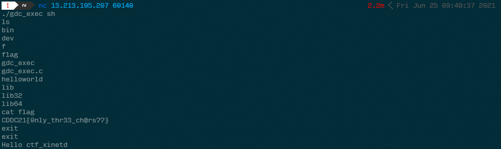

# Length Matters?

- Category: Pwn
- Points: 300
- Captures: 21

## Challenge Description:
```You are provided with credentials to a GDC server. It has an executable file that might reveal some juicy info. Find a way to exploit it.```

*(A netcat target was provided for us to access)*
## Solution:
### Tools used:
- `cat, sh, ls` 

This....was an _interesting_ challenge to say the least. With less than 15 mins left on the clock, I embarked on an epic journey to attempt to learn more about this challenge...only to pwn it - which was half lucky and half showing how terrible the balancing of flags were (I felt as though this should have been the first flag of the category?)

Anyways. Upon connecting to the challenge server, we see that this challenge is sort of similar to the first challenge of this category - [Inject it Now](../1%20-%20Inject%20it%20Now/README.md), in the sense that we also have a `flag` and a `gdc_exec` executable with SUID set, as can be seen here:


While we're here, we can also see that the executables provided in this server at `/bin/bash` is slightly different from the first challenge, in that we have `pager` and `zsh` in place of `tail` and `echo`. 

Looking in the `gdc_exec.c`, we can see the following:
```c
#include <stdio.h>
#include <string.h>
#include <stdlib.h>
#include <unistd.h>


int main(int argc, char *argv[])
{
        char command[50]; // Only takes a command of up to 50 characters
        char pref[] = "zsh -c "; // Prefixes your command with this

        if (argc == 1) return 0; // Stops the program if the program doesn't get any arguments

        bzero(command, 50); // Zeroes out the command variable
        strcpy(command, pref); // Copies the prefix

        strncpy(command + strlen(command), argv[1], 3); // copies only the first 3 characters of the argument

        setreuid(geteuid(), geteuid());

        system(command); // Executes command

        return 0;
}
```

As commented out, this program will basically run our argument (subject to a length of 3 characters) with `zsh`. So, any attempts to `cat flag` is removed because its more than 3 characters. Also, there are no longer any checks for command arguments that are passed to the program. Therefore...
<br>
<br>
<br>
we pop a shell. yes. I am not kidding
<br>
<br>
<br>

With a 3 character limit, this is more than enough to run `sh` or `zsh`. So we open a new shell that runs as root and then cat the flag from there, as shown:


_(apologies about the first line being offset)_

## Flag:
```DDC21{0nly_thr33_ch@rs??}```