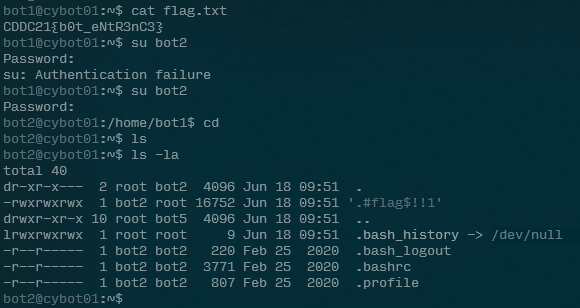
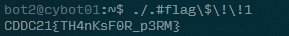

# License to Run

- Category: Linux
- Points: 100
- Captures: 39
- Challenge Helpers: [@XeniaFiorenza](https://github.com/xeniafiorenza/CTF-Writeups/tree/main/CDDC%202021)

## Challenge Description:
```
Glad to hear that you are in. bot2 has been sent to release some malicious files in a few days. Can you find and check it?
```
## Solution:


## Flag:
```
CDDC21{TH4nKsF0R_p3RM}
```