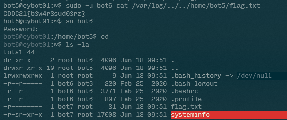
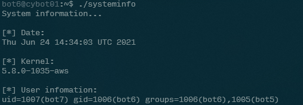
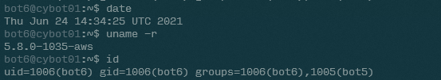
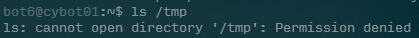
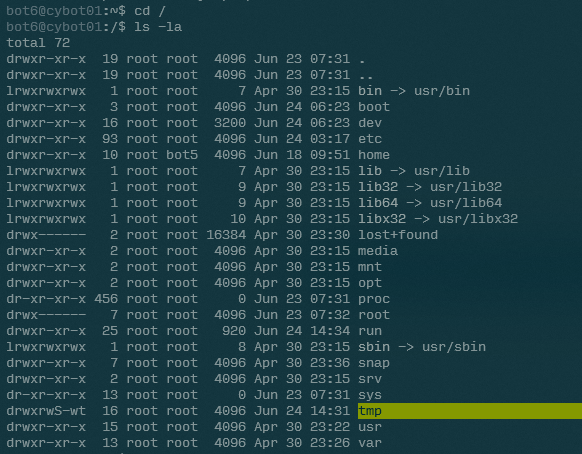
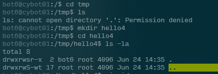
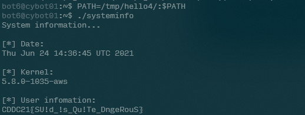

# Path to Win

- Category: Linux
- Points: 400
- Captures: 18
- Challenge Helpers: [@XeniaFiorenza](https://github.com/xeniafiorenza/CTF-Writeups/tree/main/CDDC%202021)

## Challenge Description:
```
The Cyber-BOTs system info software may lead you to the last user. Find a way to exploit it.
```
## Solution:

### Tools used:
- `ls, cat, vim, chmod`







```sh
#!/bin/bash
/bin/cat /home/bot6/flag.txt
```

## Flag:
```
CDDC21{SU!d_!s_Qu!Te_DngeRouS}
```