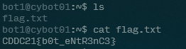

# Lock and Key 

- Category: Linux
- Points: 100
- Captures: 42
- Challenge Helpers: [@XeniaFiorenza](https://github.com/xeniafiorenza/CTF-Writeups/tree/main/CDDC%202021)

## Challenge Description:
```
One of TheKeepers has successfully obtained what seems to be one of the GDC private servers. He has sent me the image and another file, but unfortunately, I’m not great with Linux. I think you’re the one for this mission.
```
An SSH key and an IP address was given for us to access the server
## Solution:

### Tools used:
- `cat`



## Flag:
```
CDDC21{b0t_eNtR3nC3}
```