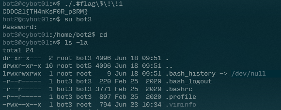
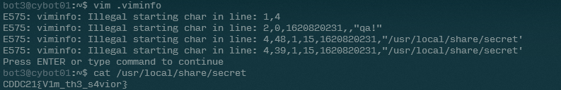

# Historian

- Category: Linux
- Points: 200
- Captures: 39
- Challenge Helpers: [@XeniaFiorenza](https://github.com/xeniafiorenza/CTF-Writeups/tree/main/CDDC%202021)

## Challenge Description:
```
Some more intel has been recovered and it hints at new program developments the cyber bots system is running, the code is supposedly used to encrypt secrets.
```
## Solution:

### Tools used:
- `vim, cat`



## Flag:
```
CDDC21{V1m_th3_s4vior}
```