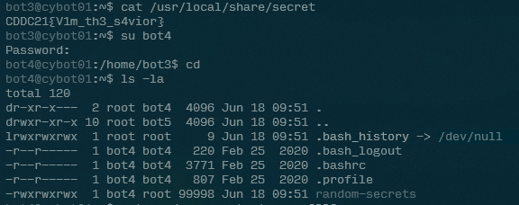
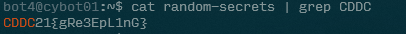

# Line Inspection

- Category: Linux
- Points: 200
- Captures: 38 
- Challenge Helpers: [@XeniaFiorenza](https://github.com/xeniafiorenza/CTF-Writeups/tree/main/CDDC%202021)

## Challenge Description:
```
The bots were able to encrypt their secrets but we found that they were owned by bot3. Are there some traces of human-readable text?
```
## Solution:

*blah blah login with previous flag*



Once we're logged in, we can see a file called `random-secrets` that is quite huge. Reading this file confirms that there are many random strings in the file.

Since we know that the flags for this CTF starts with `CDDC21{`, we can simply grep it from this file.



And we found the flag!
## Flag:
```
CDDC21{gRe3EpL1nG}
```