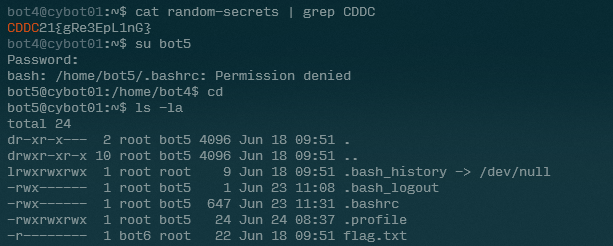
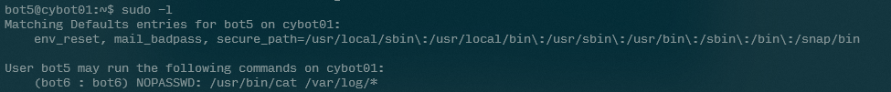
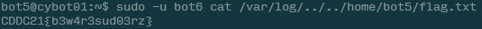

# Super

- Category: Linux
- Points: 200
- Captures: 22
- Challenge Helpers: [@XeniaFiorenza](https://github.com/xeniafiorenza/CTF-Writeups/tree/main/CDDC%202021)

## Challenge Description:
```
This bot doesn’t look so important, it seems like he can do nothing…figure out how you can move on to the next user.
```
## Solution:

### Tools used:
- `sudo, cat, ls`





## Flag:
```
CDDC21{b3w4r3sud03rz}
```