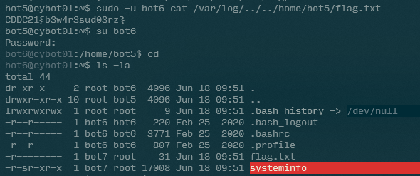
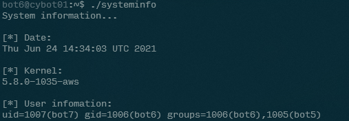
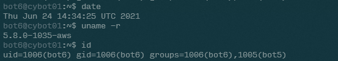
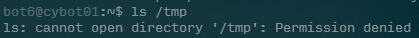
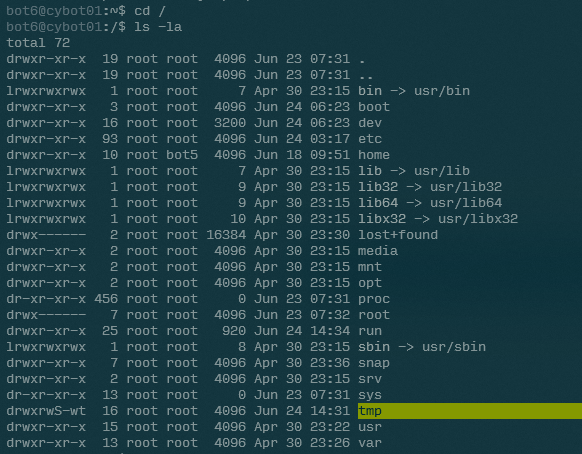
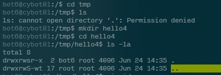
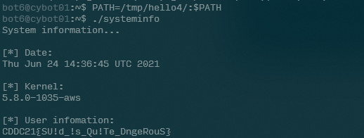

# Path to Win

- Category: Linux
- Points: 400
- Captures: 18
- Challenge Helpers: [@XeniaFiorenza](https://github.com/xeniafiorenza/CTF-Writeups/tree/main/CDDC%202021)

## Challenge Description:
```
The Cyber-BOTs system info software may lead you to the last user. Find a way to exploit it.
```
## Solution:

I will preface this solution by mentioning that this challenge is very similar to the [Insecure Challenge](../../../2021-00-DSO_NUS/Insecure/) that I completed during DSO-NUS 2021. 




Once we log onto the server, we can see that there is a `systeminfo` executable with the `SUID` bit set (visible by the `-r-sr-xr-x` permission on the executable) and a `flag.txt` file, both owned by `bot7`. This builds on the concept of `bot5`'s challenge, which required players to read the file as another user. 

Running the `systeminfo` command, we can see the following:



We can see that the `systeminfo` command retrievees information about the current server date and time (with `date`), the current kernel (with `uname -r`) and information about the user running it (with `id`). We can confirm by running the commands manually to check:



Of course, what differs when `systeminfo` runs `id` and when we run `id` ourselves is the `uid`.

This is due to `systeminfo` being owned by `bot7`, and therefore will run as `bot7` with the `SUID` bit set.

Next, let's take a look at the program with [`strings systeminfo`](./strings-sysinfo_output) to see which of the three programs we can inject:

```
=== T R U N C A T E D ===
System information
[*] Date:
/bin/date
[*] Kernel:
/bin/uname -r
[*] User infomation:
:*3$"
=== T R U N C A T E D ===
```

As we can see, both `date` and `uname` are hardlinked and may be harder to inject. On the other hand, we don't really see a hard-reference to `id`, which may allow us to hijack that instead. 

In order to hijack the `id` command, we need to have a place to write our substitute `id` somewhere. Looking into `/tmp`, we see that it is not readable at all:



So what now? Upon further inspection, we see that while `/tmp` cannot be read, it can be written to, as evidenced by its `drwxrwS-wt` (the last `r` that is missing means everyone cannot read it)



This is evidenced by us being able to create a folder inside of the `/tmp` folder, and look inside it:



With a directory to inject into our path, let's focus on what will go into our "`id` binary"...

```sh
#!/bin/bash
/bin/cat /home/bot6/flag.txt
```

In this case, we just need a simple shell script that calls `cat` to print out the contents of the `flag.txt` file in our home directory. Since `systeminfo` will call `id` with permissions of `bot7`, it should be able to read the `flag.txt` file.

We just need to make this `id` file executable with `chmod +x id`, and inject the directory into the PATH, before running `systeminfo`:




And there we have it! SUID strikes again!

## Flag:
```
CDDC21{SU!d_!s_Qu!Te_DngeRouS}
```