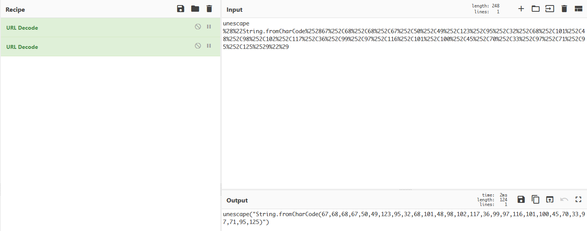

# Hidden Secret

- Category: Web
- Points: 200
- Captures: 55
- Challenge Helpers: [@Iscaraca](https://github.com/Iscaraca)

## Challenge Description:
```
This server looks promising. Can you find the secret?

Target URL: <removed>
```


## Note
We are given a target URL (which I have removed as it is just an IP address) with access to the site. Unfortunately, as I did not manage to screenshot the site. I will, however, attempt to describe the problem to you. :D
## Solution:
### Tools used:
- [CyberChef](https://gchq.github.io/CyberChef/)

Loading into the site, if we look at what files are being loaded by the website, we can find a javascript file with the following line:

```js
var pass = unescape("unescape%28%22String.fromCharCode%252867%252C68%252C68%252C67%252C50%252C49%252C123%252C95%252C32%252C68%252C101%252C48%252C98%252C102%252C117%252C36%252C99%252C97%252C116%252C101%252C100%252C45%252C70%252C33%252C97%252C71%252C95%252C125%2529%22%29");
```

A quick look at this suggests that this string is URL-Encoded, which we can easily decode with [CyberChef](https://gchq.github.io/CyberChef/):



Once the string has been decoded, we can just print what the `String.fromCharCode` evaluates to with the browser's javascript console:


Wow much magic!!
## Flag:
```
CDDC21{_ De0bfu$cated-F!aG_}
```