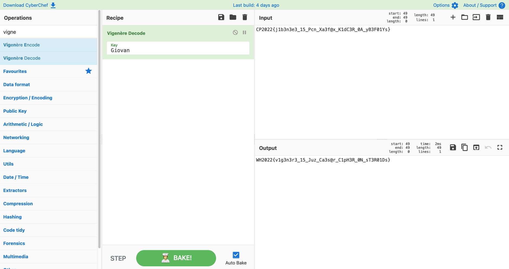

# The Indecipherable Cipher 

- Category: Crypto
- Points: 441/1000
- Captures: 55

## Challenge Description:
Some say this cipher cannot be deciphered. Well, do you believe them?

Even worse, some say this cipher is misattributed!

I would say that the key to solving this challenge is to remember who the true inventor was.

## Files Attached:
[cipher.txt](cipher.txt)

## Solution:

### Tools used:
- [CyberChef](gchq.github.io/CyberChef)

Having a look at the cipher text, we can see that the general structure of the flag was still there, but it has obviously been jumbled. Since the challenge description mentioned that `the key to solving this challenge is to remember was the true inventor was`, I guessed that the cipher used was a [vigenere cipher](https://en.wikipedia.org/wiki/Vigen%C3%A8re_cipher).

A quick look at the Wikipedia page (which is the source of Truth™) tells us that this cipher was invented by one "Giovan Battista Bellaso"

So I tried their full name! But it didn't work... not completely


So, I tried just using their first name, "Giovan", which resulted in success!



## Flag:
```
WH2022{v1g3n3r3_15_Juz_Ca3s@r_C1pH3R_0N_sT3R01Ds}
```