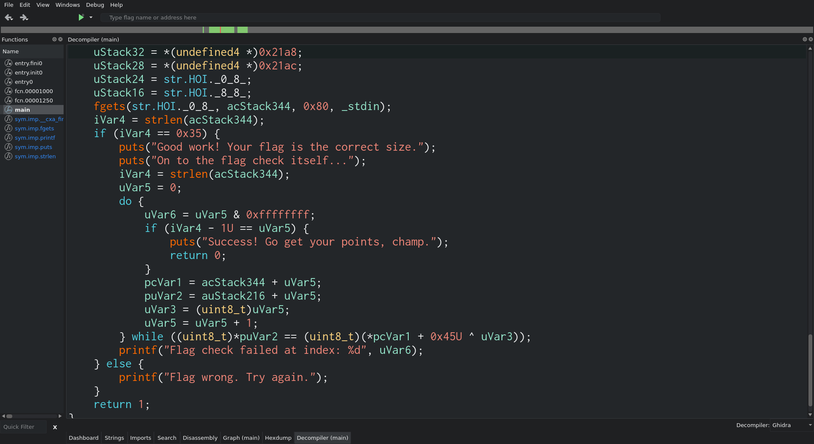
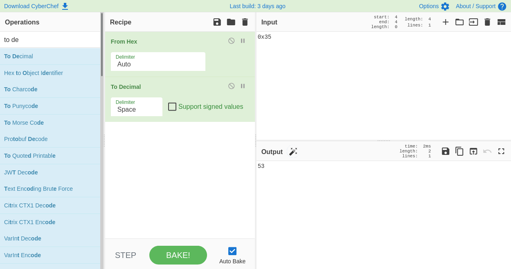
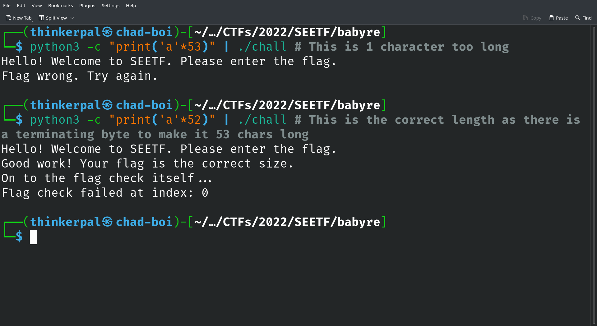
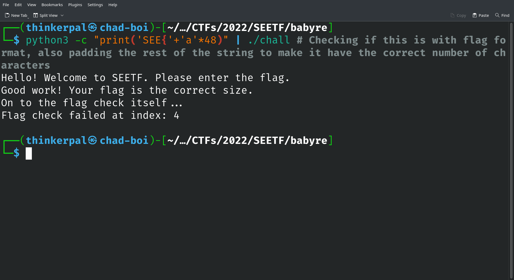
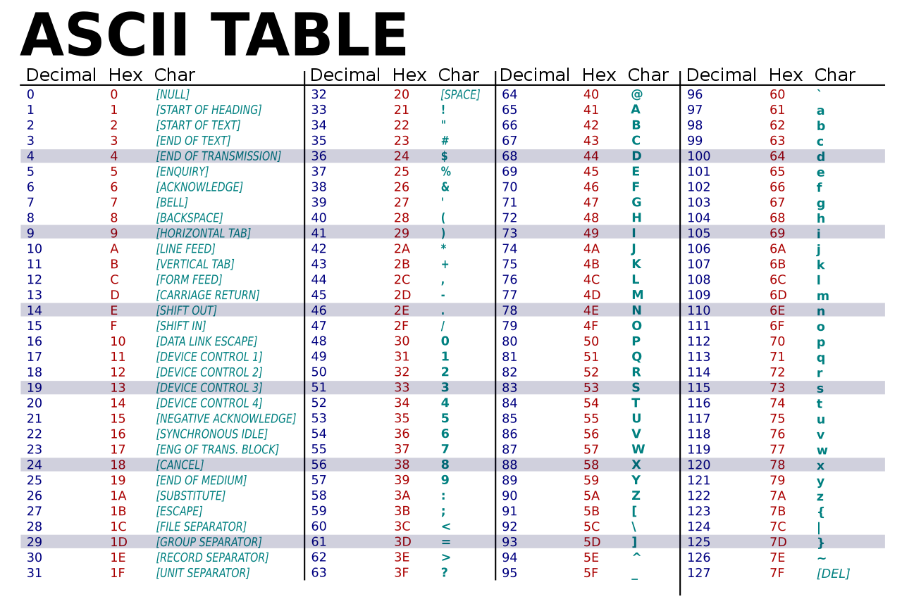
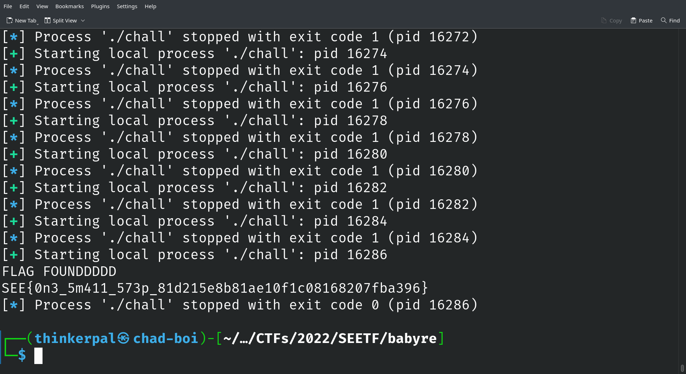

# babyreeee 

- Category: Reverse Engineering
- Points: 100/? 
- Captures: 189

## Challenge Description:
You've never seen a flagchecker this helpful.

For beginners:
https://ctf101.org/reverse-engineering/what-are-decompilers/


## Files Attached:
babyre (ELF binary)

## Solution:

### Tools used:
- [Cutter](https://cutter.re)
- [Pwntools](https://docs.pwntools.com/en/stable/install.html)

If we inspect the binary with cutter, we can use the decompiler to have a look at the main function:


_I have scrolled down to the relevant section for getting more information_

We can see that the program takes in standard input (as seen in `fgets(str.HOI._0_8_, acStack344, 0x80, _stdin);`). It then goes on to check the length of the string inputted with `iVar4 = strlen(acStack344);`, and checks if that length is equal to `0x35`, which is hexadecimal for `53` (see conversion below).



This means that the flag we are trying to guess is **52** characters long, since the terminating byte is automatically inserted when we enter our guessed flag (usually a `"\0"` — refer to [this](https://www.tutorialspoint.com/cprogramming/c_strings.htm) to get a better idea of how strings in C work). 

We can test this by sending a string of 52 characters long into the program, which reports that we have the right length flag but not the right first character as seen below.



At this point, since we know from other challenges that most of the flags have a flag format of `SEE{<flag content>}`, we can try and check if this is also the case for this program:



We test this by sending in `"SEE{"` followed by just a string of 'a's to pad the string and make it 52 characters long. As we can see, the flag check failed at index 4, and since the counting is zero-indexed, this means that the fifth character is wrong.

We can then write a Python script making use of `pwntools` to interact with the binary and brute force the flag, such as the one below:

```python
from pwn import process

foundFlag = False
SEED = "SEE{" # We know that the flag starts with this, so no need to brute force the first few characters
LENGTH = 52
POS = len(SEED)

while foundFlag != True:
    for i in range(32, 127): # Refer to table below — characters with an ASCII code of between 32 and 126 (decimal) are printable ie. they can be typed
        genstr = SEED + chr(i) + "a"*int(LENGTH-POS-1) # Generates a string with the previouisly guessed and known "correct" strings, followed by the currently guessed character, and then padded with "a"s to make sure it will be 52 characters long
        p = process('./chall') # Starts the binary
        a = p.recv()
        p.sendline(genstr.encode()) # Sends our guessed string in
        a = p.recv()
        if "champ" in a.decode(): # Flag Found condition: Program prints "Success! Go get your points, champ." if we found the flag, so we know to stop the program if that is printed.
            foundFlag = True
            print("FLAG FOUNDDDDD")
            print(genstr)
            break
        else:
            try:
                numindex = a.decode().find("index: ") # We get the index printed from the output of the program
                lookingPos = int(a[numindex+7:])
                if lookingPos > POS: # We then check if the index printed is greater than the index that we are currently guessing, and if so:
                    POS += 1 # Increases the index of the string where we are guessing the character by 1
                    SEED = SEED + chr(i) # Saves the currently guessed character into the string of known good "guessed" letters
                    print(genstr)
            except:
                print(a)
        p.close()
```

What the above script does is it tries to bruteforce each character by using the full string of correct characters, then trying every possible character until the process outputs that we have an index (when it prints `"Flag check failed at index: x"` where x is the index of the letter we are guessing) that is greater than what we previously had, which tells us that we have a correct letter guessed. 



Running the script will guess each printable ASCII character against the binary, eventually leading us to the flag!



## Flag:
```
SEE{0n3_5m411_573p_81d215e8b81ae10f1c08168207fba396}
```